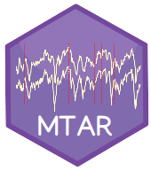

MTAR 
======================
Bayesian Analysis of Multivariate Threshold Autoregressive Models with Missing Data


The R package *MTAR* implements parameter estimation using a Bayesian approach for MTAR models with missing data using Markov Chain Monte Carlo methods. This package performs the simulation of MTAR process (`mtarsim`). Estimation of matrix parameters and the threshold values conditional on the autoregressive orders and number of regimes (`mtarns`). Identification of the autoregressive orders using Bayesian variable selection, together with coefficients and covariance matrices and the threshold values conditional on the number of regimes (`mtarstr`). Identification of the number of regimes using Metropolised Carlin and Chib or via NAIC criteria (`mtarnumreg`), to calculate NAIC of any estimated model (`mtarNAIC`). Estimate missing values together with matrix parameters conditional to threshold values, autoregressive orders and numbers of regimes (`mtarmissing`). The diagnostic of the residuals in any estimated model can be done (`diagnostic_mtar`). The package manage several class objects for autoplot and print, functions like (`tsregime`),(`mtaregime`) and (`mtarinipars`) make its construction. Finally, (`auto_mtar`) its an automatic function that perfoms all above.

## Installation
You can install the **development** version from [Github](https://github.com/adrincont/MTAR).
```s
install.packages("devtools")
devtools::install_github("adrincont/mtar")
```

## Overview
As mention in the first paragraph lets introduce the objects class and usage in the different functions.

- `tsregime` return an object class 'tsregime' which is how the package manage data.
- `mtaregime` return an object of class 'regime' use for simulation purposes and as standard presentation of the final estimations.
- `mtarsim` return an object of class 'mtarsim' use in autoplot methods. Its practical to conditionate some functions for different known parameters.
- `mtarinipars` return an object of class 'regime_inipars' that itself contains an object of class 'tsregime', it is the main object that save known parameters and parameters of the prior distributions for each parameter in a MTAR model. This object needs to be provided in every estimation function.
- `mtarns` and `mtarstr` return an object of class 'regime_model' use in print and autoplot methods, its an stardard presentation for estimations done in this functions. It is the object to introduce in `mtarNAIC`. 
- `mtarmissing` return an object of class 'regime_missing' for print and autoplot methods.
- `mtarnumreg` return an object of class 'regime_number'

## Example of use
```s
library(mtar)
library(ggplot2)

data(datasim_miss)

data = tsregime(datasim_miss$Yt,datasim_miss$Zt,datasim_miss$Xt)
autoplot.tsregime(data,1)
autoplot.tsregime(data,2)
autoplot.tsregime(data,3)

# Fill in the missing data with the component average
Y_temp = t(datasim_miss$Yt)
meanY = apply(Y_temp,1,mean,na.rm = T)
Y_temp[apply(Y_temp,2,is.na)] = meanY
Y_temp = t(Y_temp)
X_temp = datasim_miss$Xt
meanX = mean(X_temp,na.rm = T)
X_temp[apply(X_temp,2,is.na)] = meanX
Z_temp = datasim_miss$Zt
meanZ = mean(Z_temp,na.rm = T)
Z_temp[apply(Z_temp,2,is.na)] = meanZ

# Estimate the number of regimens with the completed series
data_temp = tsregime(Y_temp,Z_temp,X_temp)
initial = mtarinipars(tsregime_obj = data_temp,list_model = list(l0_max = 3),method = 'KUO')
estim_nr = mtarnumreg(ini_obj = initial,iterprev = 500,niter_m = 500,burn_m = 500, list_m = TRUE,
                      ordersprev = list(maxpj = 2,maxqj = 2,maxdj = 2),parallel = TRUE)
print(estim_nr)

# Estimate the structural and non-structural parameters 
# for the series once we know the number of regimes
initial = mtarinipars(tsregime_obj = data_temp,method = 'KUO',
                      list_model = list(pars = list(l = estim_nr$final_m),orders = list(pj = c(2,2))))
estruc = mtarstr(ini_obj = initial,niter = 500,chain = TRUE)
autoplot.regime_model(estruc,1)
autoplot.regime_model(estruc,2)
autoplot.regime_model(estruc,3)
autoplot.regime_model(estruc,4)
autoplot.regime_model(estruc,5)
cc = 1/2*(nrow(data$Yt)-2)-1
## in the table of critical values for CusumSQ we have a value of 
## 0.05333 for n = 500 and alpha = 0.05
diagnostic_mtar(estruc,CusumSQ = 0.05333)

# With the known structural parameters we estimate the missing data
list_model = list(pars = list(l = estim_nr$final_m,r = estruc$estimates$r[,2],orders = estruc$orders))
initial = mtarinipars(tsregime_obj = data_temp,list_model = list_model)
missingest = mtarmissing(ini_obj = initial,chain = TRUE, niter = 500,burn = 500)
print(missingest)
autoplot.regime_missing(missingest,1)
data_c = missingest$tsregim
# ============================================================================================#
# Once the missing data has been estimated, we make the estimates again for all the structural 
# and non-structural parameters.
# ============================================================================================#
initial = mtarinipars(tsregime_obj = data_c,list_model = list(l0_max = 3),method = 'KUO')
estim_nr = mtarnumreg(ini_obj = initial,iterprev = 500,niter_m = 500,burn_m = 500, list_m = TRUE,
                      ordersprev = list(maxpj = 2,maxqj = 2,maxdj = 2))
print(estim_nr)

initial = mtarinipars(tsregime_obj = data_c,method = 'KUO',
list_model = list(pars = list(l = estim_nr$final_m),orders = list(pj = c(2,2))))
estruc = mtarstr(ini_obj = initial,niter = 500,chain = TRUE)
autoplot.regime_model(estruc,1)
autoplot.regime_model(estruc,2)
autoplot.regime_model(estruc,3)
autoplot.regime_model(estruc,4)
autoplot.regime_model(estruc,5)
diagnostic_mtar(estruc,CusumSQ = 0.05333)
```

## For more information
You will find the theoretical basis of the method in the documents:

  - https://www.tandfonline.com/doi/abs/10.1080/03610926.2014.990758
  - https://core.ac.uk/download/pdf/77274943.pdf

## License
This package is free and open source software, licensed under GPL-3.

## References
 * Calderón Villanueva, S. A. (2014). Bayesian Analysis of Multivariate Threshold Autoregressive Models with Missing Data (Doctoral dissertation, Universidad Nacional de Colombia).

